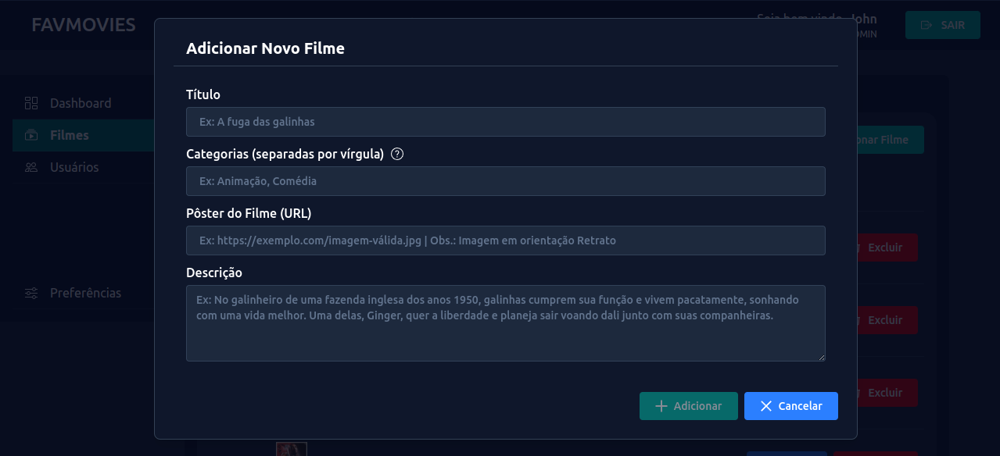

# 📘 Documentação do Frontend FavMovies

Frontend da aplicação de Trailers de Filmes, desenvolvido em **Angular 19 standalone**.
Este projeto oferece uma interface administrativa para gerenciamento de Filmes e Usuários.
Mais funcionalidades em breve.

Usuários administradores autenticados poderão:
- Visualizar insights sobre comsumo de filmes da plataforma (Visualizações, marcações como Favoritos, Avaliações, etc...)
- Gerenciar filmes e usuários cadastrados
- Editar suas próprias preferências de conta

Usuários comuns ainda não possuem interface finalizada (rota `/movies` em desenvolvimento).

---

## 🔧 Tecnologias

- Angular 19 (standalone components)
- RxJS
- Angular Router
- Angular Forms
- TypeScript
- CSS/Tailwind (opcional)
- JWT (Token via Cookie)
- Interceptors de Autenticação

---

## 📌 Requisitos

- Node.js 18+
- Angular CLI 19+
- API backend rodando em http://localhost:3000

---

## 🚀 Instalação

```bash
git clone https://github.com/seu-usuario/favmovies-frontend.git
cd favmovies-frontend
npm install
```

---

## ▶️ Execução

```bash
ng serve
```

Acesse em: [http://localhost:4200](http://localhost:4200)

---

## 🔐 Autenticação

- Login e Registro são feitos via `/auth/login` e `/auth/register`
- O token JWT é armazenado via cookie pelo backend.
- Navegação é protegida por Guards de autenticação e autorização por `role`.

---

## 🌐 Rotas

| Rota                    | Protegida | Descrição                                                                 |
|-------------------------|-----------|---------------------------------------------------------------------------|
| `/`                     | ❌        | Redireciona para `/login` se não autenticado                             |
| `/login`                | ❌        | Página de autenticação e cadastro                                        |
| `/admin`                | ✅ admin  | Página principal do painel administrativo                                |
| `/admin/dashboard`      | ✅ admin  | Página de insights da plataforma                                         |
| `/admin/movies-management` | ✅ admin | Gerenciamento de filmes (CRUD + busca + paginação)                       |
| `/admin/users-management`  | ✅ admin | Gerenciamento de usuários (promoção/rebaixamento + busca + paginação)    |
| `/admin/user-preferences` | ✅ admin | Preferências da conta (visualização e edição de perfil)                  |
| `/movies`               | ✅ user   | (Em desenvolvimento) Página inicial do usuário comum                     |

---

## 🧩 Funcionalidades

### Login e Cadastro (`/login`)
- Login com email e senha
- Cadastro com nome, email e senha
- Role padrão de novo usuário: `user`

### Painel Administrativo (`/admin`)
- Redirecionamento automático para `/admin/dashboard`
- Menu lateral com 4 seções:
  - **Dashboard**: estatísticas e rankings dos filmes com mais interações
  - **Filmes**: busca, cadastro, edição e exclusão de filmes
  - **Usuários**: busca, promoção e rebaixamento de usuários
  - **Preferências**: edição de nome/email/senha do administrador

### Preferências do Administrador
- Campos desabilitados por padrão
- Ao clicar em “Editar Preferências”, campos ficam editáveis
- A Senha permanece desabilitada até que o usuário desmarque o checkbox “Manter senha atual”
- Ações: **Salvar Alterações** ou **Cancelar**

---

## 📌 Observações Finais

- A interface de usuário comum (`/movies`) será incluída futuramente
- Somente usuários com role `"admin"` têm acesso ao painel `/admin`

---

## 🖼️ Capturas de Tela

### 🔐 Login & Registro

**Estado inicial (botões desativados)**


**Formulário de login preenchido**


**Formulário de registro preenchido**


---

### 🧭 Painel Admin - Dashboard

**Dashboard após login do admin**


---

### 🎬 Gerenciamento de Filmes

**Listagem de filmes**


**Busca realizada**


**Detalhar filme**


**Adicionar filme**


**Editar filme**


**Confirmação de exclusão**


---

### 👥 Gerenciamento de Usuários

**Listagem de usuários**


**Hover em usuário (ações visíveis)**


**Confirmação de Promoção**


**Lista atualizada após promoção**


**Confirmação de Rebaixamento**


---

### ⚙️ Preferências do Usuário

**Estado inicial (somente visualização)**


**Modo edição ativado, Senha desabilitada, Checkbox “manter senha atual” marcado**


**Modo edição ativado, Senha habilitada, Checkbox “manter senha atual” desmarcado**


**Botão salvar ativado após edições válidas**


---
